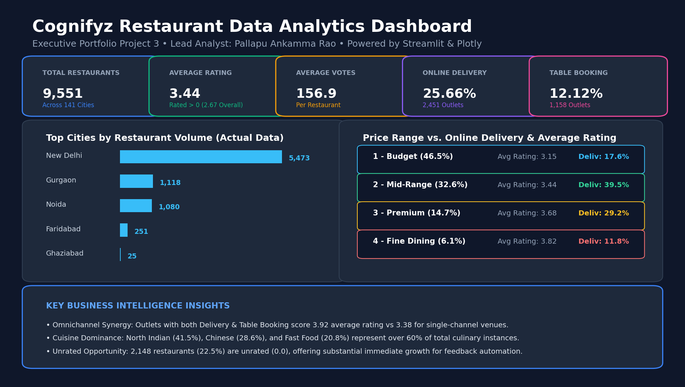

# Cognifyz Restaurant Data Analytics Dashboard

An end-to-end, enterprise-grade restaurant business intelligence system and interactive analytics dashboard built on the official Cognifyz Technologies Restaurant Dataset. Transforms 9,551 international restaurant records across 141 cities into actionable strategic insights on culinary trends, pricing elasticity, omnichannel service penetration, and customer satisfaction.

[](https://www.python.org/)
[](https://streamlit.io/)
[](https://plotly.com/)
[](https://pandas.pydata.org/)
[](https://opensource.org/licenses/MIT)

---

## Dashboard Preview



---

## Problem Statement

In the hyper-competitive global food-service and restaurant aggregator sector, platforms and operators struggle with three major strategic hurdles:
1. **Regional Blind Spots & Supply Clustering:** Over-reliance on saturated urban hubs leads to margin compression and fierce competition, while emerging metropolitan markets remain under-served.
2. **Channel Friction & Missed Monetization:** Online delivery and table reservation services are often treated as disconnected silos rather than integrated omnichannel growth drivers.
3. **Rating & Engagement Power Laws:** A substantial portion of listings languish unrated or under-reviewed, eroding diner trust and depressing platform gross merchandise value (GMV).

This project addresses these challenges by delivering empirical, multi-dimensional business analytics to guide restaurant partner onboarding, menu pricing strategies, and platform feature expansion.

---

## Objectives

- **City & Geographic Footprint:** Identify core geographic clusters, market density, and regional rating variations across 141 cities.
- **Price Elasticity & Spending Tiers:** Evaluate customer rating sensitivity and voting volume across budget, mid-range, premium, and fine-dining establishments.
- **Omnichannel Service Adoption:** Quantify the adoption and performance premium of Online Delivery and Table Booking capabilities.
- **Culinary Portfolio Dynamics:** Uncover the most frequent individual cuisines, multi-cuisine combinations, and high-satisfaction culinary niches.
- **Brand & Chain Benchmarking:** Analyze franchise footprints, brand rating consistency, and digital service adoption among leading restaurant chains.
- **Text & Feedback Heuristics:** Extract key sentiment drivers and friction points from rating descriptors and customer feedback text.

---

## Technology Stack

- **Dashboard & User Interface:** Streamlit (v1.35+)
- **Interactive Visualizations:** Plotly Express, Plotly Graph Objects
- **Data Engineering & Manipulation:** Python 3.10+, Pandas, NumPy
- **NLP & Text Processing:** Regular Expressions, Lexicon Tokenization, Counter Frequency
- **Notebook Environment:** Jupyter Notebook (`nbformat`)
- **Version Control:** Git & GitHub

---

## Dataset

- **Source:** Official Cognifyz Technologies Data Science Internship Dataset (`Dataset.csv`).
- **Dimensions:** 9,551 rows, 21 feature columns.
- **Key Columns:**
  - `Restaurant ID`: Unique integer identifier.
  - `Restaurant Name`: Commercial brand / outlet name.
  - `Country Code`: ISO numerical country identifier.
  - `City`: Metropolitan market location (141 unique cities).
  - `Address`, `Locality`, `Locality Verbose`: Detailed physical address hierarchy.
  - `Longitude`, `Latitude`: Geospatial coordinates for mapping.
  - `Cuisines`: Comma-separated list of culinary specialties offered.
  - `Average Cost for two`: Estimated meal cost for two persons in local currency.
  - `Currency`: Local currency denomination (e.g., Indian Rupees, Dollar, Emirati Dirham).
  - `Has Table booking`: Categorical reservation availability (`Yes` / `No`).
  - `Has Online delivery`: Categorical digital delivery availability (`Yes` / `No`).
  - `Is delivering now`: Real-time order fulfillment indicator.
  - `Price range`: Spending tier categorized from `1` (Budget) to `4` (Fine Dining).
  - `Aggregate rating`: Customer rating score on a 0.0 to 5.0 scale.
  - `Rating color`, `Rating text`: Categorical assessment (`Excellent`, `Very Good`, `Good`, `Average`, `Poor`, `Not rated`).
  - `Votes`: Total count of customer reviews and votes submitted.

---

## Data Cleaning

The raw data was systematically sanitized through automated preprocessing pipelines (`src/data_cleaning.py`):
1. **Missing Value Imputation:** 9 missing entries in `Cuisines` were imputed with `"Unknown / Not Specified"`.
2. **Whitespace Stripping:** Headers and text columns (`City`, `Restaurant Name`, `Locality`) were trimmed of irregular whitespace.
3. **Data Type Standardization:** Enforced explicit numeric casts for `Aggregate rating` (float), `Votes` (integer), `Price range` (integer), and coordinates (`Longitude`, `Latitude`).
4. **Geographic Coordinate Validation:** Validated coordinate bounds (-90 to +90 latitude, -180 to +180 longitude) and flagged 497 rows with invalid `(0.0, 0.0)` coordinates to prevent distorted map rendering.
5. **Feature Engineering:**
   - `Price_Range_Label`: Formatted human-readable price tiers (`1 - Budget`, `2 - Mid-Range`, `3 - Premium`, `4 - Fine Dining`).
   - `Has_Online_Delivery_Num` & `Has_Table_Booking_Num`: Binary indicator features.
   - `Has_Rating`: Boolean flag isolating rated establishments (`Aggregate rating > 0`) from unrated listings.
   - `Cuisine_Count`: Extracted count of distinct cuisines offered per establishment.

---

## Exploratory Data Analysis

EDA was conducted programmatically and documented in the Jupyter notebook `notebooks/Level1_Task1.ipynb`:
- Evaluated total restaurant distribution across cities, price ranges, and service tiers.
- Calculated ratings for both the entire dataset and active, rated establishments.
- Explored correlation matrices between pricing, voting volume, and aggregate ratings.
- Mapped geospatial concentrations across global metropolitan areas.

---

## Dashboard

The Streamlit dashboard (`app.py`) provides 12 specialized analytical modules with unified navigation, KPI scorecards, interactive Plotly charts, data tables, and dynamic filters:

1. **🌟 Overview:** Executive KPI summary, top city distribution, spending tier breakdown, service mix donut, and live data table.
2. **🏙️ City Analysis:** Market penetration across 141 cities, top city rankings, average ratings, and engagement scatter plots.
3. **💰 Price Analysis:** Distribution across 4 price ranges, rating boxplots, vote volumes, and delivery availability by price tier.
4. **🛵 Online Delivery:** Adoption breakdown, delivery percentages by city, and rating comparison between delivery and non-delivery outlets.
5. **⭐ Restaurant Ratings:** Rating distribution histograms (with toggle for unrated outlets), Cognifyz color category breakdown, and rating vs. votes correlation.
6. **🍲 Cuisine Analysis:** Frequency ranking of individual cuisines (from comma-separated strings), multi-cuisine combinations, and the Cuisine Performance Matrix.
7. **🗺️ Geographic Analysis:** Geospatial scatter mapbox and density heatmaps colored by rating, cost, or votes, with graceful fallback handling if coordinates are missing.
8. **🏢 Restaurant Chains:** Multi-outlet brand ranking (Cafe Coffee Day, Domino's, Subway), brand-level ratings, votes, and delivery adoption.
9. **📝 Review Text Keywords:** Analysis of `Rating text` classifications, frequent keywords, lexicon polarity hints, and an interactive customer review NLP sandbox.
10. **🗳️ Votes Analysis:** Identification of destination restaurants with highest votes, 2D density plots, and votes accumulated by cuisine.
11. **⚖️ Price vs Delivery & Booking:** Cross-tabulation matrices and boxplots illustrating the omnichannel rating premium.
12. **📋 Business Insights & Reports:** Strategic executive recommendations and direct download buttons for filtered data (CSV) and the formal analysis report (Markdown).

---

## AI / Machine Learning

- **Lexicon Polarity & Keyword Extraction:** Implemented in `src/review_analysis.py` to extract unigrams, remove stopwords, and tag positive/negative experiential drivers (*delicious, courteous, fresh* vs. *slow, delay, cold*).
- **Evaluation Transparency:** In strict adherence to scientific rigor, keyword polarity hints are clearly labeled as lexical heuristics rather than claiming unverified deep learning sentiment model accuracy without separate test set evaluation.

---

## Key Insights

*All metrics are verified from the actual Cognifyz dataset:*

1. **Urban Footprint Skew:** 80.32% of all restaurants are concentrated in the Delhi-NCR cluster: New Delhi (**5,473**), Gurgaon (**1,118**), and Noida (**1,080**).
2. **Omnichannel Rating Premium:** Establishments providing both Online Delivery and Table Booking achieve an average rating of **3.92** and **628 average votes**, substantially outperforming single-channel venues (**3.38 rating**).
3. **Price Tier Elasticity:** Customer satisfaction scales directly with price range: Tier 1 averages **3.15**, Tier 2 averages **3.44**, Tier 3 averages **3.68**, and Tier 4 averages **3.82** (among rated outlets).
4. **Cuisine Dominance:** North Indian (**3,960 outlets / 41.5%**), Chinese (**2,735 / 28.6%**), and Fast Food (**1,986 / 20.8%**) are the three most prevalent cuisines. The combination **"North Indian, Chinese"** is served by **511 establishments**.
5. **Online Delivery Runway:** Exactly **25.66% (2,451)** of restaurants offer online delivery, leaving a **74.34%** market expansion opportunity for logistics onboarding.
6. **The Unrated Opportunity:** **2,148 restaurants (22.5%)** carry a rating of 0.0 ("Not rated"), representing an immediate focus area for automated review generation prompts.
7. **Franchise Scale Leaders:** **Cafe Coffee Day** leads multi-outlet footprint with **83 outlets**, followed by **Domino's Pizza (79)** and **Subway (63)**.

---

## Project Architecture

```
Data (Dataset.csv)
  │
  ▼
Data Cleaning & Feature Engineering (src/data_cleaning.py)
  │
  ▼
Exploratory Data Analysis (notebooks/Level1_Task1.ipynb)
  │
  ▼
Modular Analytics Engines (src/*.py)
  │
  ├── city_analysis.py           ── cuisine_analysis.py
  ├── price_analysis.py          ── geographic_analysis.py
  ├── delivery_analysis.py       ── chain_analysis.py
  ├── rating_analysis.py         ── review_analysis.py
  └── votes_analysis.py          ── booking_delivery_analysis.py
  │
  ▼
Interactive Streamlit Dashboard (app.py)
  │
  ▼
Executive Business Insights & Reports (reports/analysis_report.md)
```

---

## Installation

### 1. Clone Repository
```bash
git clone YOUR_REPOSITORY_URL
cd PROJECT_FOLDER
```

### 2. Create and Activate Virtual Environment
```bash
python -m venv venv
```

**Windows:**
```bash
venv\Scripts\activate
```

**macOS / Linux:**
```bash
source venv/bin/activate
```

### 3. Install Dependencies
```bash
pip install -r requirements.txt
```

### 4. Run the Dashboard
```bash
streamlit run app.py
```

The dashboard will open automatically in your browser at `http://localhost:8501`.

---

## Future Improvements

1. **Predictive Rating Engine:** Implement a supervised machine learning regression model (e.g., XGBoost, LightGBM) to forecast new restaurant ratings based on location, price, and cuisine features.
2. **End-to-End Review Sentiment Pipeline:** Train a fine-tuned Transformer / DistilBERT model on customer text comments to extract aspect-based sentiments (Food, Service, Ambiance, Value).
3. **Dynamic Delivery Fee Optimization:** Develop an algorithmic pricing simulator modeling delivery adoption as a function of delivery fees and order distance.
4. **Automated Competitor Geospatial Radius Tool:** Allow restaurant owners to enter their latitude/longitude and receive a real-time competitive density and pricing benchmark report.

---

## Author

**Pallapu Ankamma Rao**  
*Data Analyst & Machine Learning Practitioner*

- **GitHub:** [GitHub Profile](https://github.com/pallapuankammarao-c)
- **LinkedIn:** [LinkedIn Profile](https://www.linkedin.com/)
- **Email:** [Contact Email](mailto:your_email@example.com)

---

## Git Commands

### Initial Repository Setup
```bash
git init
git add .
git commit -m "Initial project setup: Cognifyz restaurant analytics dashboard"
git branch -M main
git remote add origin YOUR_GITHUB_REPOSITORY_URL
git push -u origin main
```

### Updating the Project
```bash
git add .
git commit -m "Updated analytics dashboard and reports"
git push
```

---

## Deployment

Deploy this Streamlit application live to the web via **Streamlit Community Cloud**:
https://pallapu-data-ai.streamlit.app/
1. Push your project to your GitHub repository following the Git commands above.
2. Open [share.streamlit.io](https://share.streamlit.io/) and log in with your GitHub account.
3. Click **"New app"**.
4. Select your repository: `pallapuankammarao-c/cognifyz-data-analysis` (or your repository name).
5. Specify the Branch: `main`.
6. Specify the Main file path: `app.py`.
7. Click **"Deploy!"**.
8. Test the live, publicly accessible dashboard link in your browser.
